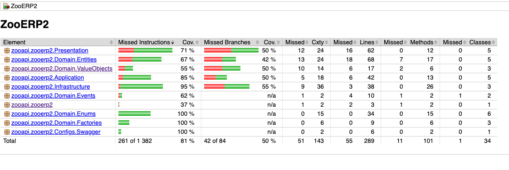

# Zoo API

## REST-API приложение для зоопарка

#### Как запускать?
    - В IntelliJ IDEA запустить задачу Main для запуска приложения или gradle(в боковом меню) Tasks/verification/test для тестирования

### Идеи решения

* Функции, требуемые по ТЗ, сгруппированы по доменным классам, с которыми они работают, и по выполняемым ими функциям. (Animals, Enclosures, Stats, ...)
* Это позволяет при внедрении зависимостей внедрять только необходимые классы.
* За хранение данных отвечают классы из поддиректории Infrastructure, которые являются обертками над ArrayList и предоставляют интерфейс доступа к данным.
* За бизнес-логику (создание новых объектов, расчеты статистики, ...) отвечает слой Application. Он же генерирует Event Objects, которые отдает в Application Event Publisher (при необходимости, можно эти данные использовать для логирования или отправить их в брокер сообщений)
* За взаимодействие с пользователем отвечает слой Presentation. Он парсит входные данные и передает их на следующий слой, а также возвращает ответы
* При необходимости (При расширении системы) можно сделать Enclosure и Animal абстрактными классами и переопределить у дочерних классов методы, позволяющие чистить вольер, проверять, подходит ли животному вольер. Но по тз это не требуется. 

#### Структура классов доменной области

* Для основных объектов из доменной области реализованы классы: Animal, Enclosure, Feeding, FeedingSchedule. 
* Для примитивов, которые не могут быть полностью представлены встроенными типами (Value Objects), написаны отдельные классы (Size3D, Name, ...)
* Для структур запросов реализованы DTO-классы.
* Для создания объектов написаны фабрики (Domain/Factories)
* Для типов животных, типов еды, пола животных и т.д. есть Enum-ы

#### Применение чистой архитектуры
* слой Presentation - Отвечает за сетевое взаимодействие с пользователем, зависит от слоя Application и от Domain
* слой Application - Отвечает за бизнес-логику приложения, зависит от слоя Infrastructure и от Domain. Объекты слоя внедряются в объекты слоя Presentation через интерфейсы.
* слой Infrastructure - Отвечает за хранение данных, внедряется в сервис через интерфейсы (см директорию Interfaces/Infrastructure), зависит только от Domain
* слой Domain - Содержит доменные классы приложения. Не зависит от других слоев.

### Применение принципов DDD

-  Часть бизнес-логики инкапсулирована в доменных объектах. Например, проверка имени животного на соответствие регулярному выражению (класс Animal) или добавление животного в вольер (класс Enclosure)
-  Реализованы классы для событий, происходящих в системе(AnimalMovedEvent, FeedingTimeEvent)
-  Для примитивных объектов реализованы Value Objects (Name, Size3D).

### Тестирование

Я решил использовать E2E тестирование, так как несмотря на то, что чистая архитектура упрощает unit-тестирование, для такого маленького проекта тесты будут составлять больше кода чем сама содержательная часть. 

#### Отчет о результатах тестирования


### Ссылка на swagger
````
http://localhost:8080/swagger-ui/index.html#/
````
