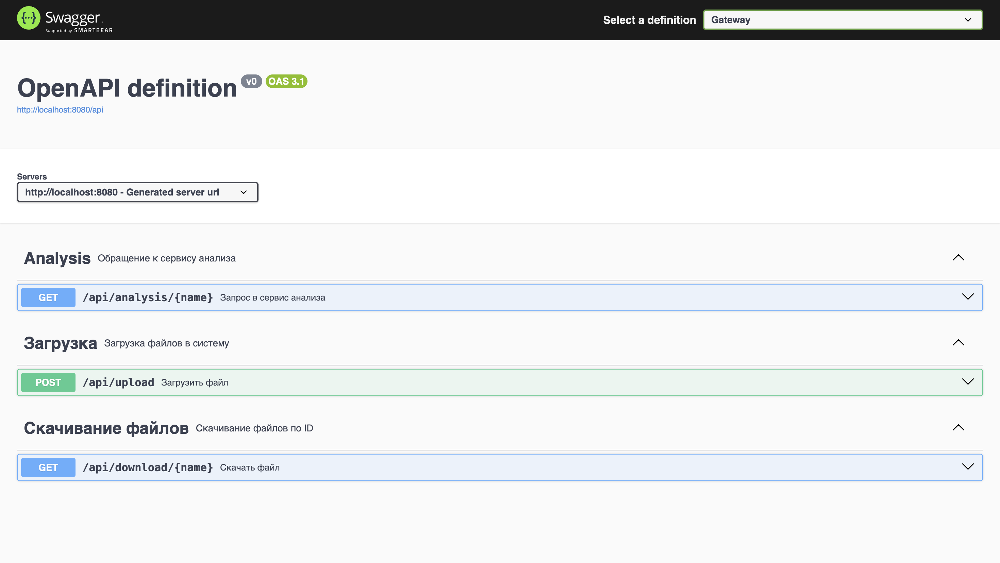
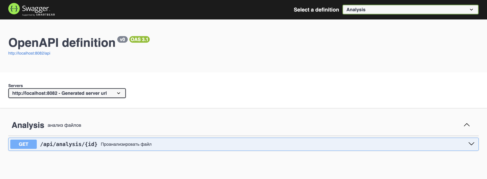
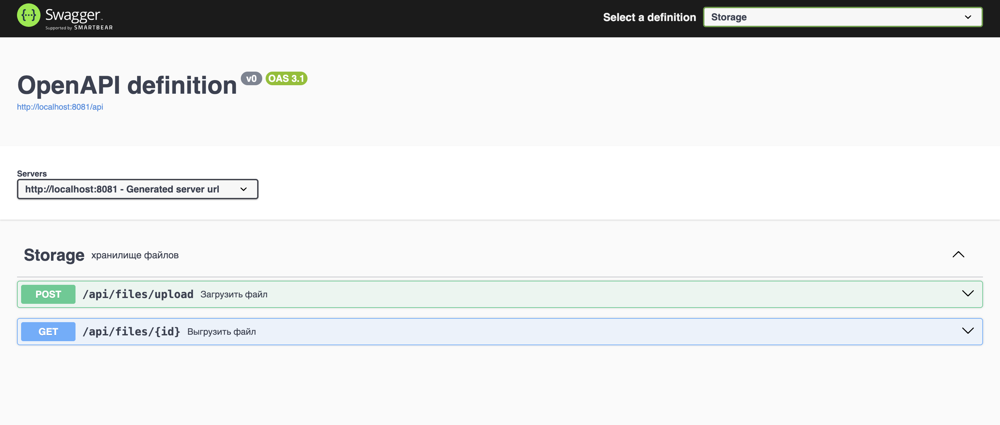
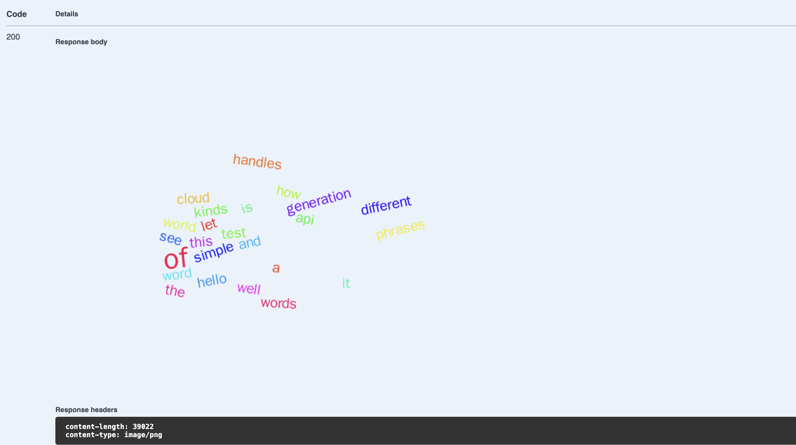

# Запуск

Для запуска всех сервисов необходимо из директории src выполнить 
```
    docker-compose build
    docker-compose up
```
# Структура и API

Приложение состоит из трех микросервисов: gateway, analysis, storage. Предполагается, что пользователь взаимодействует с сервисом gateway, 
 который перенаправляет запросы остальным сервисам. Для сервиса storage отдельный контейнер с Postgre-бд, также в отдельном контейнере   
запускается Swagger. 

для пользователя есть 3 вида запросов: положить файл в хранилище, получить файл (имени), и получить анализ 
файла (по имени). Для этого пользователь обращается к сервису gateway по эндпоинтам 
/api/upload, /api/download/{name}, /api/analysis/{name} соответственно.

При загрузке файла, gateway отправляет запрос сервису storage по эндпоинту /api/files/upload, в ответ получает ID файла, полученного 
с помощью sha256 от его содержимого. Этот же ID является ключом в бд сервиса storage, что гарантирует 
уникальность каждого файла. Сервис gateway хранит соответствия имен и ID файлов. При скачивании файла gateway отправляет запрос сервису storage на эндпоинт /api/files/{id}, где ID - 
это sha256-ID файла. 

Для анализа файла gateway отправляет запрос сервису analysis на эндпоинт 
/api/analysis/{id} (все тот же sha256-ID). Сервис analysis обращается к storage, получает файл, 
и в текстовом виде отправляет его онлайн-сервису quickchart.io. Результатом анализа является полученное изображение - 
облако слов файла.

Чтобы протестировать функционал каждого сервиса, можно подключиться к единому Swagger-у с выбором сервиса. Он запускается на порте 8083
(http://localhost:8083/)





