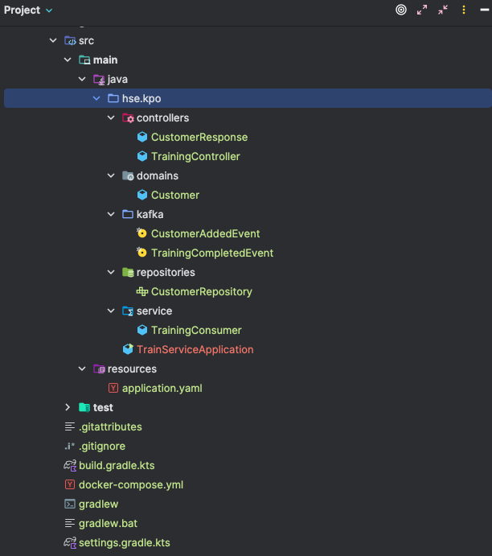

# Занятие 14. Асинхронное межсервисное взаимодействие

## Цель занятия
- Разобраться, что такое кафка, научиться ее использовать.
## Требования к реализации
- Создать новый сервис, который будет принимать событие CustomerAddedEvent из кафки, 
записывать данные о покупателе в бд, при запросе из контроллера на тренировку рук ног или iq 
кидать событие в кафку TrainingCompletedEvent.
## Тестирование
- Запустить кафку, и все с ней связанное (docker-compose-kafka.yaml).
- Запустить основное приложение и создать покупателя.
- Запустить сервис тренировки, проверить, что покупатель добавился.
- Потренировать покупателя, проверить что данные основном обновились.
## Задание на доработку
- Доделать новый микросервис
## Пояснения к реализации
Состав сервиса:

 

Ссылки

1. 

